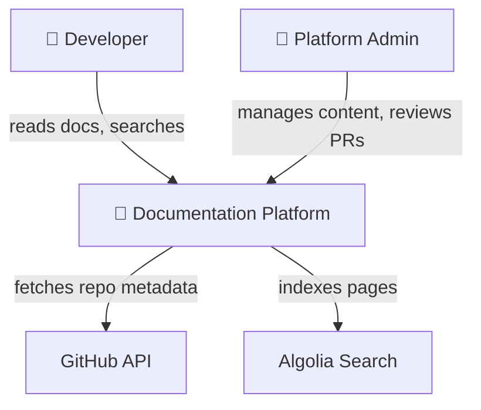
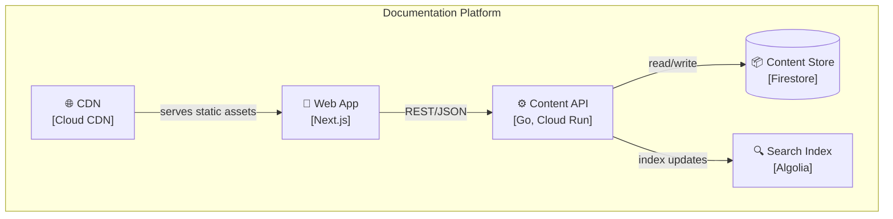
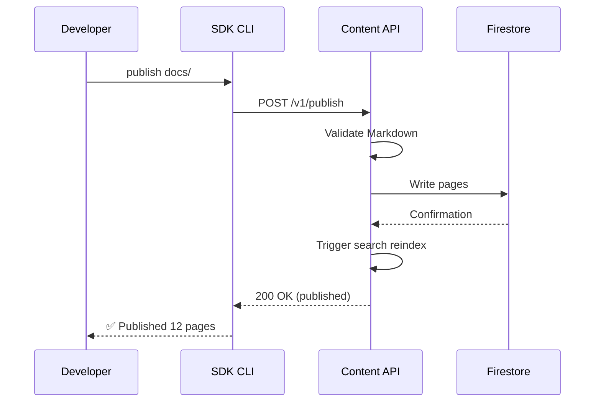
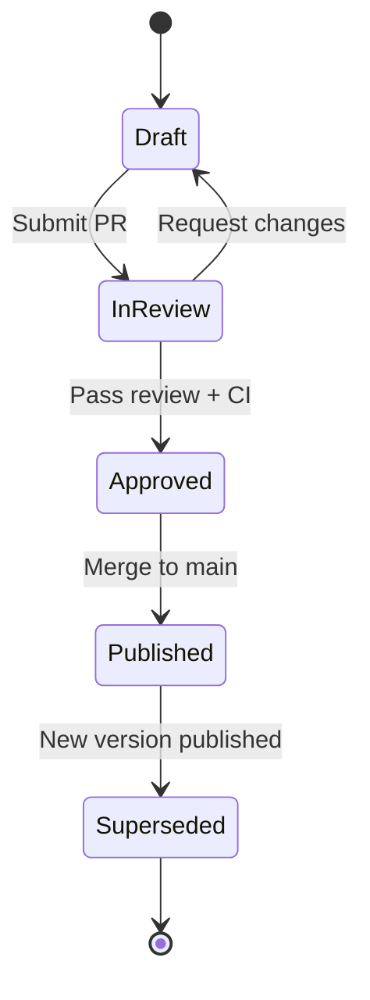
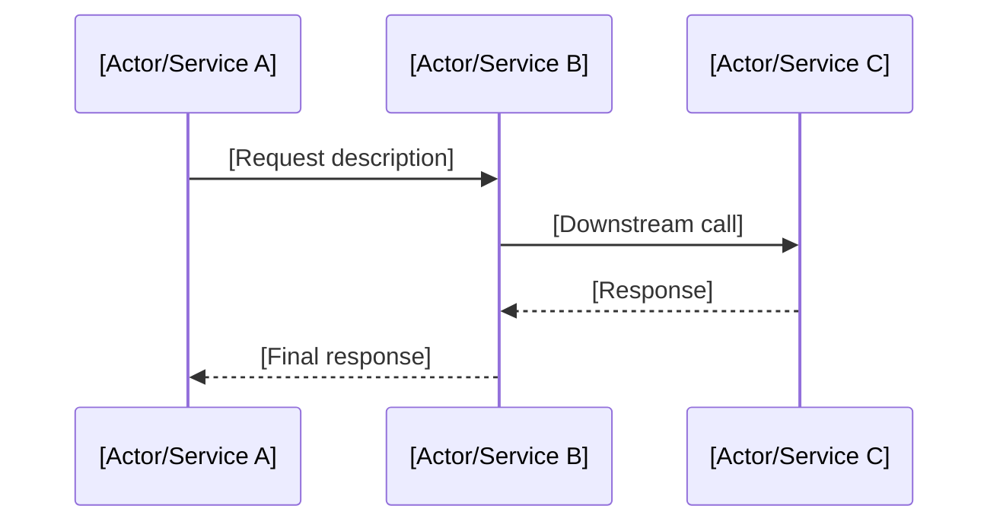

# Diagrams-as-Code

Text-only documentation is incomplete. Diagrams are first-class code citizens: they live in version control alongside source code, they are reviewed in pull requests, and they are validated for drift against the live system. A diagram that cannot be diffed is an undocumented assumption.

---

## Table of Contents
1. [Philosophy](#philosophy)
2. [Tool Selection: Mermaid.js vs D2](#tool-selection-mermaidjs-vs-d2)
3. [The C4 Model Hierarchy](#the-c4-model-hierarchy)
4. [Mermaid.js Patterns](#mermaidjs-patterns)
5. [D2 Patterns](#d2-patterns)
6. [Version Control Workflow](#version-control-workflow)
7. [Drift Detection](#drift-detection)
8. [AI-Assisted Diagram Generation](#ai-assisted-diagram-generation)
9. [Templates](#templates)

---

## Philosophy

Diagrams serve as the visual contract of a system's architecture. When a diagram disagrees with the code, one of them is lying — and the consequence is engineers making decisions based on a system that no longer exists. By treating diagrams as source code, we make this disagreement visible, reviewable, and resolvable in the same PR that introduced the change.

Every diagram must answer a specific question at a specific level of abstraction. A diagram that tries to show everything shows nothing. The C4 Model provides the hierarchy that keeps each diagram focused.

---

## Tool Selection: Mermaid.js vs D2

Both tools generate diagrams from text definitions. Choose based on the context:

| Criterion | Mermaid.js | D2 |
|-----------|------------|-----|
| **Rendering** | Browser-native (GitHub, GitLab, Docusaurus render inline) | Requires CLI compilation to SVG/PNG |
| **Syntax** | Compact, YAML-like | Declarative, HCL-like |
| **Layout** | Automatic (limited control) | Automatic with manual overrides (TALA, ELK, dagre) |
| **Complexity** | Best for simple-to-moderate diagrams | Best for complex, multi-container architectures |
| **Ecosystem** | Ubiquitous Markdown support | Standalone `.d2` files, CI rendering |
| **Entity Relationships** | Supported (erDiagram) | Supported (crow's foot notation) |
| **Theming** | CSS-based themes | Style blocks with CSS-like properties |

### Decision Heuristic

- **Use Mermaid.js** when the diagram will be rendered inline in Markdown documentation (README files, Docusaurus pages, GitHub PRs) and the layout is simple enough for automatic placement.
- **Use D2** when the diagram requires precise layout control, complex container nesting, or will be compiled to high-fidelity SVG for publication.
- **Use both** when the project has inline documentation diagrams (Mermaid) and formal architecture documents (D2).

---

## The C4 Model Hierarchy

The C4 Model breaks system architecture into four levels of abstraction. Each level answers a different question, and each level uses a different diagram scope. Never try to show all four levels in a single diagram.

### Level 1: System Context

**Question:** What is the system, and how does it interact with the outside world?

**Scope:** The system as a single box, surrounded by its users (people, roles) and external systems (third-party services, APIs, databases owned by other teams).

**Audience:** Non-technical stakeholders, new team members, product managers.

**Rules:**
- The system under discussion is a single labeled box.
- External actors (users, systems) surround it.
- Arrows show relationships ("uses", "sends data to", "authenticates via").
- No internal details are shown — this is the 30,000-foot view.

### Level 2: Container

**Question:** What are the high-level technology building blocks inside the system?

**Scope:** The runtime containers (web apps, APIs, databases, message brokers, mobile apps) that compose the system. A "container" here is a separately deployable unit, not a Docker container.

**Audience:** Developers, architects, DevOps engineers.

**Rules:**
- Each container gets a labeled box with its technology (e.g., "API Service [Go, Cloud Run]").
- Arrows show inter-container communication with protocols (HTTP, gRPC, AMQP, SQL).
- External systems and users from Level 1 are shown as simplified boundary elements.

### Level 3: Component

**Question:** What are the major structural building blocks inside a single container?

**Scope:** The internal components (controllers, services, repositories, adapters) within one container.

**Audience:** Developers working on that specific container.

**Rules:**
- Each component gets a labeled box with its responsibility.
- Arrows show internal dependencies ("calls", "reads from", "publishes to").
- Only one container is decomposed per diagram. Other containers appear as external boundary boxes.

### Level 4: Code

**Question:** How does a specific, high-risk algorithm or data structure work?

**Scope:** Class diagrams, sequence diagrams, or state machines for critical code paths.

**Audience:** Developers maintaining the specific module.

**Rules:**
- Use this level sparingly — only for high-risk, complex, or frequently misunderstood code.
- Prefer sequence diagrams for complex workflows and state machines for lifecycle management.
- If the code is simple enough to understand by reading it, a Level 4 diagram adds no value.

---

## Mermaid.js Patterns

### System Context (C4 Level 1)



### Container Diagram (C4 Level 2)



### Sequence Diagram (C4 Level 4)



### State Diagram



---

## D2 Patterns

### System Context (C4 Level 1)

```d2
direction: right

developer: Developer {
  shape: person
}

admin: Platform Admin {
  shape: person
}

system: Documentation Platform {
  shape: rectangle
  style: {
    fill: "#E1F5FE"
    stroke: "#0288D1"
  }
}

github: GitHub API {
  shape: cloud
}

search: Algolia Search {
  shape: cloud
}

developer -> system: reads docs, searches
admin -> system: manages content
system -> github: fetches repo metadata
system -> search: indexes pages
```

### Container Diagram (C4 Level 2)

```d2
direction: down

platform: Documentation Platform {
  webapp: Web App {
    label: "Web App\n[Next.js, Cloud Run]"
    shape: rectangle
  }
  api: Content API {
    label: "Content API\n[Go, Cloud Run]"
    shape: rectangle
  }
  db: Content Store {
    label: "Content Store\n[Firestore]"
    shape: cylinder
  }
  search: Search Index {
    label: "Search Index\n[Algolia]"
    shape: rectangle
  }

  webapp -> api: REST/JSON
  api -> db: read/write
  api -> search: index updates
}
```

### Complex Layout with Containers

```d2
direction: right

ingestion: Ingestion Layer {
  git_hook: Git Webhook Handler
  parser: Markdown Parser
  validator: Content Validator

  git_hook -> parser -> validator
}

storage: Storage Layer {
  firestore: Firestore {
    shape: cylinder
  }
  gcs: Cloud Storage {
    shape: cylinder
  }
}

serving: Serving Layer {
  cdn: Cloud CDN
  ssr: SSR Renderer
  api: REST API

  cdn -> ssr
  api -> ssr
}

ingestion.validator -> storage.firestore
ingestion.validator -> storage.gcs: binary assets
storage.firestore -> serving.api
storage.gcs -> serving.cdn
```

---

## Version Control Workflow

### File Organization

Store diagram source files alongside the documentation they describe:

```
docs/
├── architecture/
│   ├── context.mmd          # Mermaid: System Context (L1)
│   ├── containers.d2        # D2: Container diagram (L2)
│   ├── api-components.mmd   # Mermaid: API Components (L3)
│   └── auth-sequence.mmd    # Mermaid: Auth flow (L4)
├── getting-started.md
└── api-reference.md
```

### PR Review Checklist

When a PR changes system architecture, the reviewer verifies:

1. **Diagram exists:** Any PR that changes service boundaries, adds a dependency, or modifies inter-service communication must include a corresponding diagram update.
2. **Level is correct:** The diagram operates at the right C4 level for the change (e.g., adding a new service → update the Container diagram, not the Code diagram).
3. **Labels are current:** Container names, technology labels, and protocol annotations match the implementation.
4. **Diff is reviewable:** The diagram change is visible in the PR diff as a text change, not a binary blob.

### CI Rendering

Configure CI to render diagram source files to SVG/PNG and include the rendered output in the documentation build:

```yaml
# GitHub Actions example
- name: Render D2 diagrams
  run: |
    for file in docs/architecture/*.d2; do
      d2 "$file" "${file%.d2}.svg"
    done

- name: Render Mermaid diagrams
  uses: mermaid-js/mermaid-cli-action@v1
  with:
    input: "docs/architecture/*.mmd"
    output: "docs/architecture/"
```

---

## Drift Detection

Diagram drift occurs when the live system diverges from the documented architecture. Detect drift through these mechanisms:

### Dependency Graph Analysis

Parse the codebase's dependency graph (import statements, service registry, infrastructure-as-code) and compare against the declared diagram structure. Flag discrepancies as warnings in CI.

### Automated Inventory

Maintain a machine-readable inventory of services, databases, and communication channels. Compare this inventory against the diagram source files to identify:

- **Missing containers:** Services that exist in the infrastructure but are absent from diagrams.
- **Phantom containers:** Containers that appear in diagrams but no longer exist in the infrastructure.
- **Stale connections:** Communication paths that have changed protocols or been removed.

### Review Triggers

Configure code ownership rules so that changes to infrastructure-as-code, service registration, or dependency configurations automatically request review from the documentation team:

```yaml
# CODEOWNERS
docs/architecture/     @docs-team
infrastructure/        @docs-team @platform-team
```

---

## AI-Assisted Diagram Generation

Use AI tools to generate draft diagrams from existing system metadata:

1. **Repository analysis:** Parse `go.mod`, `package.json`, `requirements.txt`, and infrastructure files to extract the dependency graph.
2. **Draft generation:** Generate a Level 2 Container diagram from the dependency graph, with containers labeled by their technology stack.
3. **Human review:** The generated diagram is always a draft. A human architect reviews, corrects, and enriches the diagram before it is committed.
4. **Continuous validation:** After the diagram is committed, the drift detection system monitors for divergence.

The AI does not replace architectural understanding — it accelerates the initial draft and surfaces components that engineers might overlook.

---

## Templates

### Mermaid.js C4 Level 1 Template

```mermaid
graph TB
  %% External Actors
  User["👤 [User Role]"]
  ExternalSystem["[External System Name]"]

  %% The System
  System["🔲 [System Name]"]

  %% Relationships
  User -->|[action verb]| System
  System -->|[action verb]| ExternalSystem
```

### D2 C4 Level 2 Template

```d2
direction: down

system_name: [System Name] {
  service_a: [Service A] {
    label: "[Service A]\n[[Technology]]"
    shape: rectangle
  }
  service_b: [Service B] {
    label: "[Service B]\n[[Technology]]"
    shape: rectangle
  }
  database: [Database] {
    label: "[Database]\n[[Technology]]"
    shape: cylinder
  }

  service_a -> service_b: [protocol]
  service_b -> database: [protocol]
}
```

### Mermaid.js Sequence Diagram Template


